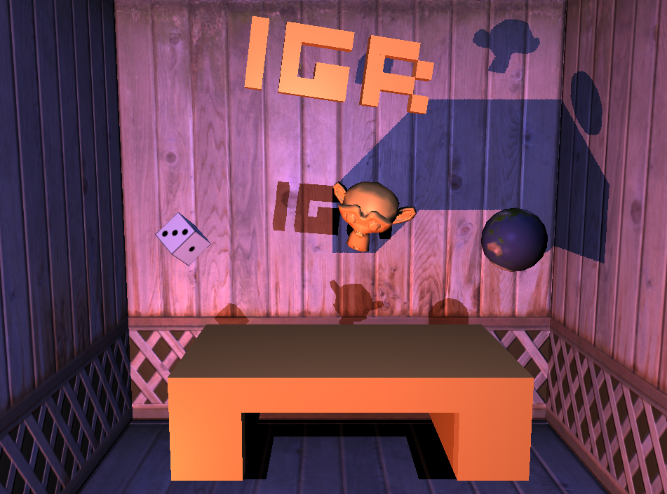

# Custom-RigidSim

**A custom OpenGL generator of graphical and physical objects with rigid body simulation.**

Final project for **IG03 – Fundamentals of Computer Graphics**, Télécom Paris (Institut Polytechnique de Paris).
Author: [Pedro Nascimento Coêlho](https://github.com/PedroNCPro)

Repository: <https://github.com/PedroNCPro/Custom-RigidSim>




---

## Table of Contents

- [Overview](#overview)
- [Report](#report)
- [Getting Started](#getting-started)
- [Controls](#controls)
- [Configuring the Scene](#configuring-the-scene)
  - [Initializers](#initializers)
  - [Light attributes](#light-attributes)
  - [Mesh methods](#mesh-methods)
  - [Material attributes](#material-attributes)
  - [Graphical Object attributes](#graphical-object-attributes)
  - [Graphical Object methods](#graphical-object-methods)
- [Example](#example)

---

## Overview

Custom-RigidSim is a small 3D "engine" inspired by game engines such as Unity, Godot and Unreal, where a user can easily create and animate 3D models. It explores three modules of the computer graphics domain:

1. **Geometry** – several mesh types, including a 3D voxelized model generated from a 2D binary matrix, plus Loop subdivision for smoothing.
2. **Rendering** – textures, normal mapping, specular lighting and shadow mapping.
3. **Simulation** – rigid body dynamics with a custom collision solver that works with meshes of **any shape**.

The main focus of the project is the **Simulation** module: a robust collision solver handling vertex–face and edge–edge collisions between arbitrary triangle meshes.

## Report

For the full details, see the project report: [`IG03___Final_Project_Report.pdf`](IG03___Final_Project_Report.pdf).


## Getting Started

### Prerequisites

- A C++ compiler with C++11 (or later) support
- [CMake](https://cmake.org/)
- OpenGL-capable GPU and drivers (plus the dependencies listed in `CMakeLists.txt`)

### Run

Build the binary file using:

```bash
cmake -B build
make -C build
```

Then launch the generated executable (`CustomRigidSim`).

## Controls

**Mouse**

| Button | Action |
|--------|--------|
| Left | Rotate camera |
| Middle | Zoom |
| Right | Pan camera |

**Keyboard**

| Key | Action |
|-----|--------|
| `H` | Print help |
| `P` | Toggle simulation |
| `R` | Reset simulation |
| `S` | Save a screenshot |
| `W` | Wireframe rendering |
| `F` | Surface rendering |
| `L` | Apply one step of Loop subdivision to the central mesh |
| `ESC` | Quit the program |

## Configuring the Scene

You can freely change the objects displayed and their attributes inside the `configScene()` function in `config.cpp`. The program is built around four customized structures: **Lights**, **Meshes**, **Materials** and **Graphical Objects**.

### Initializers

| Method | Description |
|--------|-------------|
| `create_light` | Creates a `Light`. Optional arguments: width and length of the shadow map resolution. |
| `create_mesh` | Creates a `Mesh`. Requires a name; optional arguments: path of a mesh file to load (`.off`) and a boolean to enable Loop subdivision for this mesh. |
| `create_material` | Creates a `Material`. Requires a name; optional arguments: path of an albedo texture and path of a normal texture. |
| `create_graphical_object` | Creates a Graphical Object. Requires a name, a reference to a `Mesh` and a reference to a `Material`; optional argument to enable physical animation. |

### Light attributes

| Attribute | Type | Default | Description |
|-----------|------|---------|-------------|
| `position` | `glm::vec3` | `(0, 0, 0)` | Position of the light source. |
| `color` | `glm::vec3` | `(1, 1, 1)` | Light color in normalized RGB. |
| `intensity` | `float` | `1.0f` | Intensity of the light color. |
| `perspec_angle` | `float` | `0.0f` | FOV angle of the perspective projection used for shadows. If zero, orthographic projection is used. |

### Mesh methods

| Method | Description |
|--------|-------------|
| `addPlane` | Gives a square plane shape. Optional: side length. |
| `addBox` | Gives a block shape. Requires width, length and depth; optional: block center in model space. |
| `addSphere` | Gives a spherical shape. Requires a radius; optional: resolution (vertices per meridian). |
| `meshFromMatrix` | Gives a custom shape from a 2D binary matrix (each `1` is a voxel). Requires the matrix; optional: voxel dimensions. |

### Material attributes

| Attribute | Type | Default | Description |
|-----------|------|---------|-------------|
| `albedo` | `glm::vec3` | `(0, 0, 0)` | Albedo color in normalized RGB. |
| `specK` | `float` | `0.5f` | Specular coefficient `k`. |
| `specA` | `float` | `30.0f` | Specular coefficient `α`. |
| `restitution` | `float` | `1.0f` | Restitution coefficient in collisions with this material. |
| `damping` | `float` | `0.0f` | Damping parameter in collisions with this material. |

### Graphical Object attributes

| Attribute | Type | Default | Description |
|-----------|------|---------|-------------|
| `mesh` | `shared_ptr<Mesh>` | `nullptr` | The object's mesh. |
| `material` | `shared_ptr<Material>` | `nullptr` | The object's material. |
| `rigidAtt` | `shared_ptr<BodyAttributes>` | `nullptr` | The object's body attributes, if it has any. |
| `modelMat` | `glm::mat4` | `(1.0)` | The object's world space matrix. |

### Graphical Object methods

| Method | Description |
|--------|-------------|
| `setBodyCenter` | Changes the physical center of the body (updates `modelMat`). Requires the new center. |
| `addBoxBody` | Turns the object into a body with the physical shape of a block. Requires the block dimensions. |
| `addBoxedBody` | Turns the object into a body with a block's moment of inertia, using the vertices and edges of a `Mesh`. Requires a mesh reference and block dimensions. |
| `addRoundBody` | Turns the object into a body with a sphere's moment of inertia, using the vertices and edges of a `Mesh`. Requires a mesh reference and the sphere radius. |

## Example

The snippet below is an illustrative sketch of how a scene can be described inside `configScene()`. Check the exact signatures in the source code.

A table-shaped custom mesh is generated from this binary matrix (the first row becomes a single block thanks to the rectangle-finding algorithm):

```
1 1 1 1 1
1 0 0 0 1
1 0 0 0 1
```

Typical workflow:

1. Create one or more **lights** and set `position`, `color`, `intensity` and `perspec_angle`.
2. Create **meshes** (`addBox`, `addSphere`, `meshFromMatrix`, or load an `.off` file).
3. Create **materials** (colors, textures, specular and restitution/damping parameters).
4. Create **graphical objects** combining a mesh and a material, and turn them into rigid bodies with `addBoxBody`, `addBoxedBody` or `addRoundBody`.
5. Press `P` to start the simulation and `R` to reset it.

